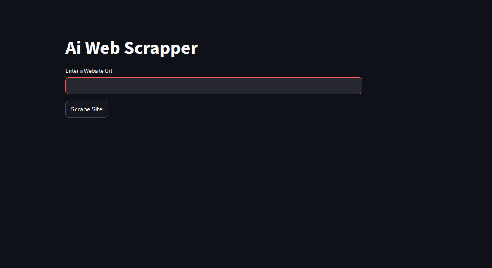
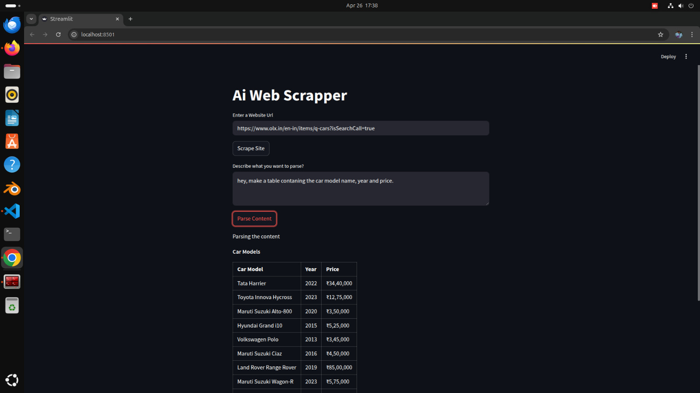

# 🕸️ AI Web Scraper using Python & LLM

An intelligent web scraping application built with **Python**, powered by **Selenium**, **BeautifulSoup**, **LangChain**, and **Ollama**. This app takes a website URL, scrapes and cleans the DOM content, and lets you interact with the scraped data using natural language prompts. Perfect for extracting structured info from unstructured web pages using AI.


## 🚀 Features

* 🔗 Enter any website URL to scrape
* 🧠 Extract meaningful content from raw DOM using AI
* 💬 Ask natural language questions to parse data
* 🔍 View full scraped DOM content
* ⚙️ Tools used: `Selenium`, `BeautifulSoup`, `LangChain`, `Ollama`, `Streamlit`

---

## 📷 Preview




## Result



---

## 🛠️ Tech Stack

| Tool          | Purpose                          |
| ------------- | -------------------------------- |
| Python        | Core language                    |
| Streamlit     | Web interface                    |
| Selenium      | Web scraping                     |
| BeautifulSoup | HTML parsing                     |
| LangChain     | Prompt template + chaining logic |
| Ollama        | Local LLM backend (LLaMA3)       |

---

## 📂 Project Structure

```bash
.
├── main.py              # Streamlit frontend
├── scrape.py            # Scraping logic (Selenium + BS4)
├── parse.py             # Parsing logic using LangChain + Ollama
├── chromedriver         # Chrome driver for Selenium
├── requirements.txt     # Python dependencies
└── README.md
```

---

## 📦 Installation

1. **Clone the repository**

```bash
git clone https://github.com/your-username/ai-web-scraper.git
cd ai-web-scraper
```

2. **Create and activate a virtual environment**

```bash
python -m venv venv
source venv/bin/activate    # On Windows: venv\Scripts\activate
```

3. **Install dependencies**

```bash
pip install -r requirements.txt
```

4. **Install and run Ollama**

Follow instructions at [https://ollama.com](https://ollama.com) to install `ollama`, then download and run the LLaMA model:

```bash
ollama run llama3
```

5. **Run the app**

```bash
streamlit run main.py
```

---

## ✨ How It Works

1. You enter a website URL.
2. `Selenium` loads the page and gets the HTML content.
3. `BeautifulSoup` extracts and cleans the `<body>` tag.
4. You type a natural language question.
5. The DOM is split into chunks and passed to `LLaMA 3` via `LangChain` prompts.
6. The AI parses and returns specific content matching your query.

---

## 🧠 Sample Use Cases

* 🔍 Scrape a blog and ask:
  *"Give me all the dates mentioned in the blog posts."*

* 📋 Extract headlines from a news site:
  *"List all article headlines from this page."*

---

## 📝 To-Do

* [ ] Add scroll support to Selenium scraper
* [ ] Add support for multi-page scraping
* [ ] Save parsed results to CSV/JSON
* [ ] Add dark mode to UI

---


[](https://tinkerhub.org/tinkerspace)

